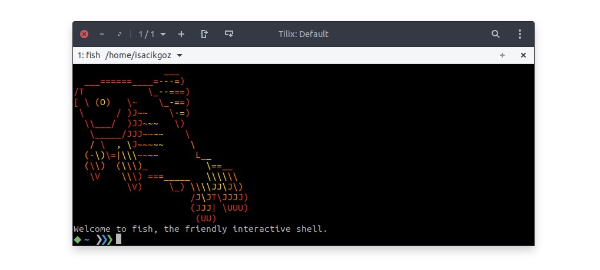

# Sashimi

[](https://github.com/isacikgoz/sashimi/releases)
[](LICENSE)

A minimal [fish shell](https://github.com/fish-shell/fish-shell) prompt made of raw fish.

Sashimi uses your prompt real estate as low as possible. It focuses on only required information. Along with being minimalist, the error codes are shown to user so that you can start to debug from a better point. See the features list for more detailed information.

<p align="center">
   
</p>

## Features

- Compatible with fish 3.0+
- Sleek
  - Displays only the parent directory instead of the entire working directory
- Git Support
  - Shows clean/dirty status
  - Shows branch ahead/behind information
  - Discourages working on master branch
- Informative When Required
  - Shows error exit status in red

### Installation

You can install sashimi by cloning this repository and linking the `fish_prompt.fish` file to your `~/.config/fish/functions` directory or any directory in your fish functions path.

```shell
git clone https://github.com/isacikgoz/sashimi
cd sashimi
ln -s fish_prompt.fish ~/.config/fish/functions/fish_prompt.fish
```

If you are using a package manager, you have the following options:

- Using [Fisher](https://github.com/jorgebucaran/fisher):
  ```shell
  fisher add isacikgoz/sashimi
  ```
- Or, if you prefer [Oh My Fish!](https://github.com/oh-my-fish/oh-my-fish):
  ```shell
  omf install sashimi
  ```

## Credits

This prompt was inspired by other promps such as:

- [robbyrussell](https://github.com/robbyrussell/oh-my-zsh/blob/master/themes/robbyrussell.zsh-theme)
- [sorin](https://github.com/fish-shell/fish-shell/tree/master/share/tools/web_config/sample_prompts)
- [bobthefish](https://github.com/oh-my-fish/theme-bobthefish)

## License

[MIT](LICENSE)
